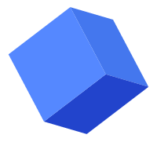
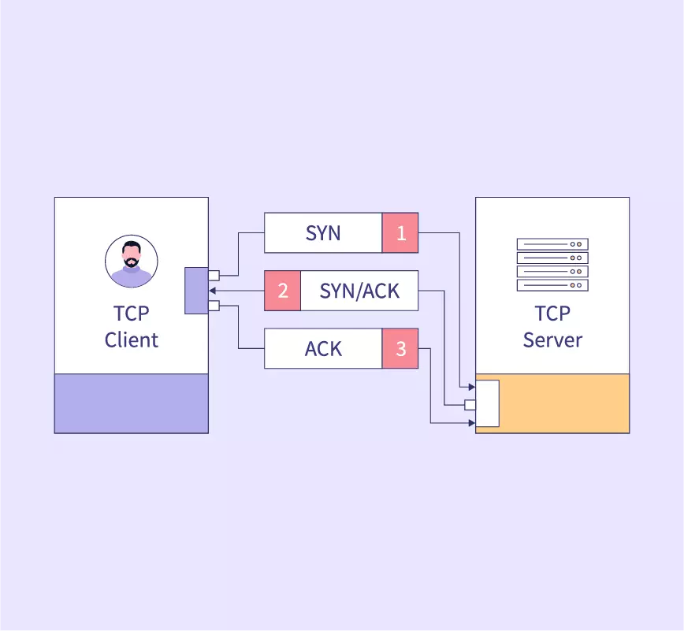

  
# Olá, Meu nome é Davy!

---

## Projetos Pessoais

**Golang e TDD | Uma réplica do [Redis](https://github.com/redis/redis)** \
[**Go Redis**](https://github.com/ThreeDP/build-a-redis) • fev 2024 - presente  
`Projeto com finalidade de replicar funcionalidades da aplicação Redis utilizando metodologia TDD e a linguagem go.`

***

**C e TDD | Rederizador de objetos 3D foto realista** \
[**MiniRobT**](https://github.com/mini-RoboTao/miniRobT) • junho 2023 - Agosto 2023  
`Algoritmo gráfico de raytracing para representações reais de objetos em 3D.`

***

**C e TDD | Uma réplica do bash** \
[**Minishelly**](https://github.com/MichelyPrado/minishelly) • abril 2023 - Maio 2023  
`Minishelly é sobre o desenvolvimento de um shell em C, replicando funcionalidades do bash, utilizando TDD para garantir qualidade.`

***

**Kubernetes, Terraform, GCP e AWS | Deploy e Migração de aplicação na cloud** \
[**Imersão Cloud**](https://github.com/ThreeDP/imersao_cloud) • janeiro 2024 - Janeiro 2024  
`Deploy e migração de dados para uma estrutura multi-cloud utilizando kubernetes, terraform, shell script,` [AWS](https://aws.amazon.com/pt/) e [GCP](https://cloud.google.com).

***

**C++ | Servidor de resposta Criptografada** \
[**Echo TCP**](https://github.com/ThreeDP/imersao_cloud) • janeiro 2024 - janeiro 2024  
`Implementação de comunicação TCP com criptografia de mensagem com O algoritmo de cifra Linear Congruencial Generator (LCG)`.

***

**Docker, Nginx, MariaDB e Wordpress | Orquestrando Containers Docker** \
[**Inception**](https://github.com/ThreeDP/Inception) • outubro 2023 - Outubro 2023  
`Deploy de uma aplicação Wordpress com web server Nginx e banco de dados SQL MariaDB com Docker.`

***

**C++ e Git | Aplicação de programação orientada a objetos** \
[**OOP com C++**](https://github.com/ThreeDP/cpp-piscine) • setembro 2023 - Outubro 2023  
`Desenvolvimentos de programas orientados a objetos em CPP, aplicação de herança, poliformismo, classes abstradas, interfaces, encapsulamento.`
***

**C, Git e Makefile | Threads e concorrência** \
[**Philosophers**](https://github.com/ThreeDP/philo) • junho 2023 - Junho 2023  
`Solução para o clássico problema dos filosofos, aplicação de Threads e programação concorente.`
***

**C, Git e Makefile | Jogo 2D** \
[**So Long**](https://github.com/ThreeDP/so_long) • abril 2023 - Maio 2023  
`Um mini jogo utilizando linguagem C, aplicação de estrutura de dados e algoritmo de busca heurística.`

***

